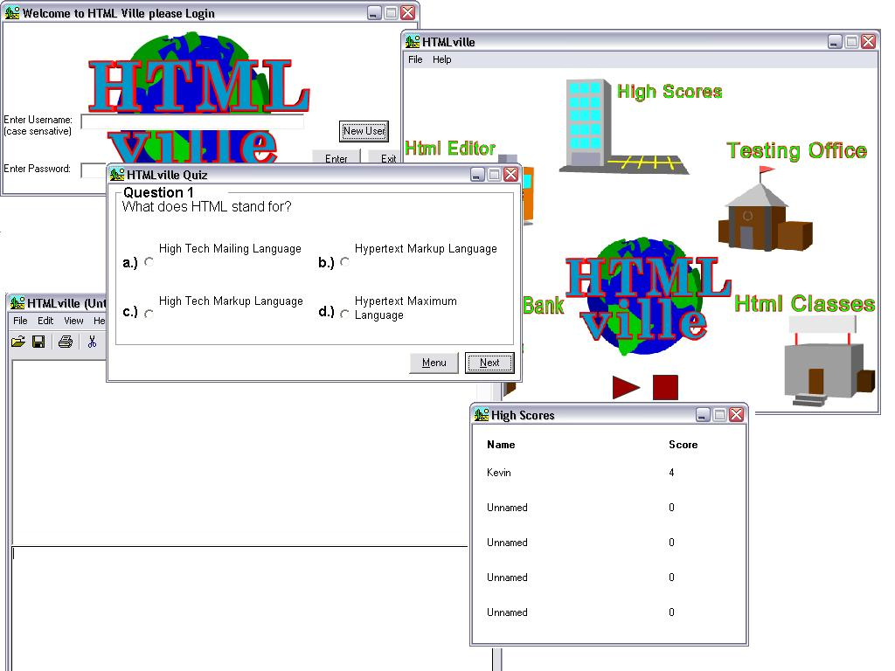

## HTMLville v1\.0

### Description

This is a program I made with my group for my computer applications class. It is an HTML tutor, and it has such features as lessons, a code library, quizzes, a high score list, and an editor. It uses an Access Database to store usernames/passwords for the login, username/score for the high score board. New users can easily start a new account, the default account name is User/User. I hope you find this code useful :D
 
### More Info
 
I am hoping to continue developing this program, so hopefully I can keep releasing new versions.

             |
---                |---
**Submitted On**   |2002-06-03 17:36:28
**By**             |[KevinLawrence](https://github.com/Planet-Source-Code/PSCIndex/blob/master/ByAuthor/kevinlawrence.md)
**Level**          |Intermediate
**User Rating**    |4.7 (14 globes from 3 users)
**Compatibility**  |VB 6\.0, VBA MS Access
**Category**       |[Complete Applications](https://github.com/Planet-Source-Code/PSCIndex/blob/master/ByCategory/complete-applications__1-27.md)
**World**          |[Visual Basic](https://github.com/Planet-Source-Code/PSCIndex/blob/master/ByWorld/visual-basic.md)
**Archive File**   |[HTMLville\_89712632002\.zip](https://github.com/Planet-Source-Code/kevinlawrence-htmlville-v1-0__1-35444/archive/master.zip)

### API Declarations

Copyright Kevin Lawrence, Zac Andrew, and Steven Pearce. Please note that the copyright on the program is void, as "Applications Eh" is a fake company made up for the project presentation. Feel free to modify this puppy to your pleasure.

